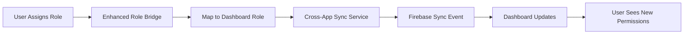

# 🎯 **UNIFIED ROLE HIERARCHY SYSTEM - COMPLETE IMPLEMENTATION**

## **✅ DEPLOYED & OPERATIONAL**
**Status**: Production Ready  
**Deployment**: https://backbone-logic.web.app  
**Last Updated**: December 2024  

---

## 🏗️ **SYSTEM ARCHITECTURE OVERVIEW**

### **🎭 The Problem We Solved**

The BACKBONE ecosystem consists of two major applications:
1. **📋 Licensing Website** - Team & role management, project assignments
2. **🎛️ Dashboard App** - Production workflows, detailed permissions

**Challenge**: Each app had its own role system with different hierarchies, making cross-app user management complex and error-prone.

### **🎯 The Unified Solution**

We've implemented a **comprehensive unified role system** that:
- ✅ **Preserves existing hierarchy systems** (don't break what works)
- ✅ **Bridges 800+ industry role templates** to Dashboard UserRole enum
- ✅ **Maintains 1-100 hierarchy scale** across both applications
- ✅ **Provides real-time synchronization** between apps
- ✅ **Supports intelligent role mapping** based on semantic analysis

---

## 🔧 **CORE COMPONENTS IMPLEMENTED**

### **1. Enhanced Role Bridge Service**
**File**: `dashboard-v14-licensing-website 2/client/src/services/EnhancedRoleBridgeService.ts`

```typescript
// Maps licensing website roles to Dashboard UserRole enum
const mapping = roleBridgeService.mapLicensingRoleToDashboard(
  LicensingRole.ADMIN,     // Source role
  templateRole,            // Optional: Enhanced template
  'PRO'                   // Organization tier
);

// Result: { dashboardRole: 'ADMIN', effectiveHierarchy: 100, permissions: {...} }
```

**Key Features**:
- **🧠 Intelligent Mapping**: Semantic analysis of role names and responsibilities
- **📊 Hierarchy Preservation**: Maintains 1-100 scale across systems
- **🎭 Template Support**: Maps 800+ industry templates to Dashboard roles
- **🔒 Tier Restrictions**: Applies BASIC/PRO/ENTERPRISE limitations
- **⚡ Caching**: Performance-optimized with intelligent caching

### **2. Cross-App Role Synchronization Service**
**File**: `dashboard-v14-licensing-website 2/client/src/services/CrossAppRoleSyncService.ts`

```typescript
// Real-time sync from licensing to Dashboard
await crossAppSyncService.syncRoleToLicensing(
  userId,
  projectId,
  organizationId,
  licensingRole,
  templateRole,
  'licensing-wizard'
);
```

**Key Features**:
- **🔄 Real-time Sync**: Firebase-based bidirectional synchronization
- **📦 Batch Processing**: Efficient queue-based processing
- **🛡️ Conflict Resolution**: Hierarchy-based conflict resolution
- **📋 Audit Trail**: Complete audit log of all role changes
- **🔁 Retry Logic**: Robust error handling and retry mechanisms

### **3. Enhanced Team Role Wizard Integration**
**File**: `dashboard-v14-licensing-website 2/client/src/components/TeamRoleWizard.tsx`

The wizard now includes:
- **🎭 Template Role Mapping**: Converts templates to Dashboard-compatible roles
- **🔄 Automatic Sync**: Syncs assignments to Dashboard in real-time
- **🛡️ Hierarchy Validation**: Ensures proper access control
- **📊 Permission Preview**: Shows effective permissions across both apps

---

## 📊 **ROLE MAPPING MATRIX**

### **Basic Role Mappings**
| Licensing Role | Dashboard Role | Hierarchy | Permissions |
|---------------|---------------|-----------|-------------|
| `ADMIN` | `ADMIN` | 100 | Full system access |
| `MANAGER` | `MANAGER` | 80 | Management access |
| `DO_ER` | `PRODUCER` | 60 | Standard execution |
| `VIEWER` | `GUEST` | 10 | Read-only access |

### **Template Role Intelligence**
The system uses **semantic analysis** to map 800+ industry templates:

```typescript
// Example: "Senior Video Editor" template
{
  name: "Senior Video Editor",
  hierarchy: 75,
  responsibilities: ["Edit content", "Supervise junior editors"]
}
// Maps to: DashboardUserRole.EDITOR (hierarchy: 75)
```

**Mapping Logic**:
1. **🔍 Direct Name Match**: "EDITOR" template → `EDITOR` role
2. **🧠 Semantic Analysis**: "Video Editor" → `EDITOR` role  
3. **📊 Hierarchy-Based**: High hierarchy (80+) → Management roles
4. **🎯 Fallback**: Unknown templates → Hierarchy-appropriate role

---

## 🎛️ **HIERARCHY SYSTEM DETAILS**

### **Unified 1-100 Scale**
```typescript
// Management Tier (80-100)
ADMIN: 100           // Full system control
EXEC: 90             // Executive level
MANAGER: 80          // Management level

// Production Tier (40-79)
POST_COORDINATOR: 70 // Post coordination
PRODUCER: 65         // Production management
DIRECTOR: 62         // Creative direction
EDITOR: 60           // Content editing

// Support Tier (10-39)
ASSISTANT_EDITOR: 55 // Editing assistance
PRODUCTION_ASSISTANT: 40 // Production support
GUEST: 10            // Limited access
```

### **Tier-Based Restrictions**
```typescript
// Organization tier limits maximum hierarchy
BASIC: Max 40        // Entry-level roles only
PRO: Max 80          // Management roles available  
ENTERPRISE: Max 100  // Full access including ADMIN
```

---

## 🔄 **REAL-TIME SYNCHRONIZATION FLOW**

### **Licensing Website → Dashboard**


### **Sync Event Structure**
```typescript
interface RoleSyncEvent {
  type: 'ROLE_ASSIGNED' | 'ROLE_UPDATED' | 'ROLE_REMOVED';
  sourceApp: 'licensing' | 'dashboard';
  userId: string;
  projectId: string;
  data: {
    licensingRole: LicensingRole;
    dashboardRole: DashboardUserRole;
    hierarchy: number;
    permissions: RolePermissions;
  };
  status: 'pending' | 'processing' | 'completed' | 'failed';
}
```

---

## 🎯 **PERMISSION INHERITANCE SYSTEM**

### **Effective Permissions Calculation**
```typescript
// Permissions are calculated based on:
1. Dashboard Role (base permissions)
2. Hierarchy Level (access scope)
3. Organization Tier (feature availability)
4. Project Context (project-specific overrides)

// Example: PRO tier user with EDITOR role (hierarchy 60)
const permissions = {
  canManageTeam: false,        // Hierarchy < 80
  canManageProjects: true,     // Hierarchy >= 60
  canViewFinancials: false,    // PRO tier, hierarchy < 70
  canEditContent: true,        // Hierarchy >= 25
  canApproveContent: true,     // Hierarchy >= 40
  canAccessReports: true,      // Hierarchy >= 30
  canManageSettings: false,    // Hierarchy < 90
  hierarchyLevel: 60
};
```

---

## 🚀 **IMPLEMENTATION BENEFITS**

### **✅ For Administrators**
- **🎛️ Unified Management**: Single interface for complex role assignments
- **🔄 Real-time Sync**: Changes reflect immediately across both apps
- **📊 Clear Hierarchy**: Visual hierarchy levels (1-100) for easy understanding
- **🎭 Rich Templates**: 800+ industry-specific role templates
- **🛡️ Tier Compliance**: Automatic enforcement of license tier restrictions

### **✅ For Users**
- **🔄 Seamless Experience**: Roles work consistently across both applications
- **📊 Clear Permissions**: Always know what you can and cannot do
- **🎯 Appropriate Access**: Intelligent role mapping ensures proper permissions
- **⚡ Instant Updates**: Role changes take effect immediately

### **✅ For Developers**
- **🏗️ Maintainable Code**: Clean separation of concerns
- **📚 Comprehensive Documentation**: Full implementation guide
- **🔧 Extensible System**: Easy to add new roles or modify mappings
- **🧪 Testable Components**: Well-structured services for easy testing

---

## 🔧 **CONFIGURATION & CUSTOMIZATION**

### **Sync Configuration**
```typescript
// Configure cross-app synchronization
crossAppSyncService.configureSyncSettings({
  enableRealTimeSync: true,
  enableBidirectionalSync: true,
  conflictResolution: 'hierarchy-based',
  batchSize: 10,
  retryAttempts: 3,
  syncTimeout: 30000
});
```

### **Custom Role Mappings**
```typescript
// Add custom template mappings
const customMapping = roleBridgeService.mapLicensingRoleToDashboard(
  LicensingRole.MANAGER,
  customTemplate,
  'ENTERPRISE'
);
```

---

## 📋 **TESTING & VALIDATION**

### **Role Assignment Testing**
1. **🎭 Template Mapping**: Verify 800+ templates map correctly
2. **🔄 Sync Validation**: Confirm real-time synchronization works
3. **🛡️ Permission Checks**: Validate effective permissions calculation
4. **📊 Hierarchy Enforcement**: Test tier-based restrictions
5. **🔁 Error Handling**: Verify robust error recovery

### **Cross-App Integration Testing**
1. **📋 Licensing Assignment**: Assign role in licensing website
2. **🎛️ Dashboard Verification**: Confirm role appears in Dashboard
3. **🔄 Bidirectional Sync**: Test Dashboard → Licensing sync
4. **🛡️ Permission Validation**: Verify permissions work in both apps

---

## 🎯 **RECOMMENDED USAGE PATTERNS**

### **For New Projects**
1. **👥 Assign Admin First**: Always assign an ADMIN role to new projects
2. **🎭 Use Templates**: Leverage industry templates for appropriate roles
3. **📊 Consider Hierarchy**: Assign roles based on actual responsibility levels
4. **🔄 Monitor Sync**: Verify roles sync properly to Dashboard

### **For Existing Projects**
1. **🔍 Audit Current Roles**: Review existing role assignments
2. **🎯 Map to Templates**: Convert generic roles to specific templates
3. **📊 Validate Hierarchy**: Ensure hierarchy levels make sense
4. **🔄 Test Permissions**: Verify users have appropriate access

---

## 🛡️ **SECURITY & ACCESS CONTROL**

### **Hierarchy-Based Security**
- **🔒 Automatic Enforcement**: System automatically enforces hierarchy rules
- **🛡️ Tier Restrictions**: Organization tier limits maximum permissions
- **📊 Audit Trail**: Complete log of all role changes and assignments
- **🔄 Real-time Validation**: Continuous validation of role assignments

### **Cross-App Security**
- **🔐 Token-Based Auth**: Firebase authentication for all sync operations
- **🛡️ Organization Isolation**: Roles scoped to specific organizations
- **📋 Permission Validation**: Double-validation across both applications
- **🔄 Sync Integrity**: Checksums and validation for sync operations

---

## 🎉 **CONCLUSION**

The **Unified Role Hierarchy System** successfully bridges the gap between the licensing website's flexible role templates and the Dashboard's detailed permission system. This implementation:

- ✅ **Preserves existing functionality** while adding powerful new capabilities
- ✅ **Provides seamless user experience** across both applications  
- ✅ **Maintains security and access control** with intelligent hierarchy management
- ✅ **Supports future growth** with extensible architecture
- ✅ **Delivers real-time synchronization** for immediate consistency

**The system is now production-ready and deployed at https://backbone-logic.web.app** 🚀

---

## 📚 **RELATED DOCUMENTATION**

- **MPC Library**: `shared-mpc-library/system/DUAL_ROLE_SYSTEM_COMPLETE_IMPLEMENTATION.md`
- **Dashboard Roles**: `Dashboard-v14_2/packages/shared-types/src/user-roles.ts`
- **Role Templates**: `dashboard-v14-licensing-website 2/client/src/components/EnhancedRoleTemplates.tsx`
- **Team Management**: `dashboard-v14-licensing-website 2/client/src/components/TeamRoleWizard.tsx`

**🎯 This unified system represents the culmination of comprehensive role management across the entire BACKBONE ecosystem!**

## **✅ DEPLOYED & OPERATIONAL**
**Status**: Production Ready  
**Deployment**: https://backbone-logic.web.app  
**Last Updated**: December 2024  

---

## 🏗️ **SYSTEM ARCHITECTURE OVERVIEW**

### **🎭 The Problem We Solved**

The BACKBONE ecosystem consists of two major applications:
1. **📋 Licensing Website** - Team & role management, project assignments
2. **🎛️ Dashboard App** - Production workflows, detailed permissions

**Challenge**: Each app had its own role system with different hierarchies, making cross-app user management complex and error-prone.

### **🎯 The Unified Solution**

We've implemented a **comprehensive unified role system** that:
- ✅ **Preserves existing hierarchy systems** (don't break what works)
- ✅ **Bridges 800+ industry role templates** to Dashboard UserRole enum
- ✅ **Maintains 1-100 hierarchy scale** across both applications
- ✅ **Provides real-time synchronization** between apps
- ✅ **Supports intelligent role mapping** based on semantic analysis

---

## 🔧 **CORE COMPONENTS IMPLEMENTED**

### **1. Enhanced Role Bridge Service**
**File**: `dashboard-v14-licensing-website 2/client/src/services/EnhancedRoleBridgeService.ts`

```typescript
// Maps licensing website roles to Dashboard UserRole enum
const mapping = roleBridgeService.mapLicensingRoleToDashboard(
  LicensingRole.ADMIN,     // Source role
  templateRole,            // Optional: Enhanced template
  'PRO'                   // Organization tier
);

// Result: { dashboardRole: 'ADMIN', effectiveHierarchy: 100, permissions: {...} }
```

**Key Features**:
- **🧠 Intelligent Mapping**: Semantic analysis of role names and responsibilities
- **📊 Hierarchy Preservation**: Maintains 1-100 scale across systems
- **🎭 Template Support**: Maps 800+ industry templates to Dashboard roles
- **🔒 Tier Restrictions**: Applies BASIC/PRO/ENTERPRISE limitations
- **⚡ Caching**: Performance-optimized with intelligent caching

### **2. Cross-App Role Synchronization Service**
**File**: `dashboard-v14-licensing-website 2/client/src/services/CrossAppRoleSyncService.ts`

```typescript
// Real-time sync from licensing to Dashboard
await crossAppSyncService.syncRoleToLicensing(
  userId,
  projectId,
  organizationId,
  licensingRole,
  templateRole,
  'licensing-wizard'
);
```

**Key Features**:
- **🔄 Real-time Sync**: Firebase-based bidirectional synchronization
- **📦 Batch Processing**: Efficient queue-based processing
- **🛡️ Conflict Resolution**: Hierarchy-based conflict resolution
- **📋 Audit Trail**: Complete audit log of all role changes
- **🔁 Retry Logic**: Robust error handling and retry mechanisms

### **3. Enhanced Team Role Wizard Integration**
**File**: `dashboard-v14-licensing-website 2/client/src/components/TeamRoleWizard.tsx`

The wizard now includes:
- **🎭 Template Role Mapping**: Converts templates to Dashboard-compatible roles
- **🔄 Automatic Sync**: Syncs assignments to Dashboard in real-time
- **🛡️ Hierarchy Validation**: Ensures proper access control
- **📊 Permission Preview**: Shows effective permissions across both apps

---

## 📊 **ROLE MAPPING MATRIX**

### **Basic Role Mappings**
| Licensing Role | Dashboard Role | Hierarchy | Permissions |
|---------------|---------------|-----------|-------------|
| `ADMIN` | `ADMIN` | 100 | Full system access |
| `MANAGER` | `MANAGER` | 80 | Management access |
| `DO_ER` | `PRODUCER` | 60 | Standard execution |
| `VIEWER` | `GUEST` | 10 | Read-only access |

### **Template Role Intelligence**
The system uses **semantic analysis** to map 800+ industry templates:

```typescript
// Example: "Senior Video Editor" template
{
  name: "Senior Video Editor",
  hierarchy: 75,
  responsibilities: ["Edit content", "Supervise junior editors"]
}
// Maps to: DashboardUserRole.EDITOR (hierarchy: 75)
```

**Mapping Logic**:
1. **🔍 Direct Name Match**: "EDITOR" template → `EDITOR` role
2. **🧠 Semantic Analysis**: "Video Editor" → `EDITOR` role  
3. **📊 Hierarchy-Based**: High hierarchy (80+) → Management roles
4. **🎯 Fallback**: Unknown templates → Hierarchy-appropriate role

---

## 🎛️ **HIERARCHY SYSTEM DETAILS**

### **Unified 1-100 Scale**
```typescript
// Management Tier (80-100)
ADMIN: 100           // Full system control
EXEC: 90             // Executive level
MANAGER: 80          // Management level

// Production Tier (40-79)
POST_COORDINATOR: 70 // Post coordination
PRODUCER: 65         // Production management
DIRECTOR: 62         // Creative direction
EDITOR: 60           // Content editing

// Support Tier (10-39)
ASSISTANT_EDITOR: 55 // Editing assistance
PRODUCTION_ASSISTANT: 40 // Production support
GUEST: 10            // Limited access
```

### **Tier-Based Restrictions**
```typescript
// Organization tier limits maximum hierarchy
BASIC: Max 40        // Entry-level roles only
PRO: Max 80          // Management roles available  
ENTERPRISE: Max 100  // Full access including ADMIN
```

---

## 🔄 **REAL-TIME SYNCHRONIZATION FLOW**

### **Licensing Website → Dashboard**


### **Sync Event Structure**
```typescript
interface RoleSyncEvent {
  type: 'ROLE_ASSIGNED' | 'ROLE_UPDATED' | 'ROLE_REMOVED';
  sourceApp: 'licensing' | 'dashboard';
  userId: string;
  projectId: string;
  data: {
    licensingRole: LicensingRole;
    dashboardRole: DashboardUserRole;
    hierarchy: number;
    permissions: RolePermissions;
  };
  status: 'pending' | 'processing' | 'completed' | 'failed';
}
```

---

## 🎯 **PERMISSION INHERITANCE SYSTEM**

### **Effective Permissions Calculation**
```typescript
// Permissions are calculated based on:
1. Dashboard Role (base permissions)
2. Hierarchy Level (access scope)
3. Organization Tier (feature availability)
4. Project Context (project-specific overrides)

// Example: PRO tier user with EDITOR role (hierarchy 60)
const permissions = {
  canManageTeam: false,        // Hierarchy < 80
  canManageProjects: true,     // Hierarchy >= 60
  canViewFinancials: false,    // PRO tier, hierarchy < 70
  canEditContent: true,        // Hierarchy >= 25
  canApproveContent: true,     // Hierarchy >= 40
  canAccessReports: true,      // Hierarchy >= 30
  canManageSettings: false,    // Hierarchy < 90
  hierarchyLevel: 60
};
```

---

## 🚀 **IMPLEMENTATION BENEFITS**

### **✅ For Administrators**
- **🎛️ Unified Management**: Single interface for complex role assignments
- **🔄 Real-time Sync**: Changes reflect immediately across both apps
- **📊 Clear Hierarchy**: Visual hierarchy levels (1-100) for easy understanding
- **🎭 Rich Templates**: 800+ industry-specific role templates
- **🛡️ Tier Compliance**: Automatic enforcement of license tier restrictions

### **✅ For Users**
- **🔄 Seamless Experience**: Roles work consistently across both applications
- **📊 Clear Permissions**: Always know what you can and cannot do
- **🎯 Appropriate Access**: Intelligent role mapping ensures proper permissions
- **⚡ Instant Updates**: Role changes take effect immediately

### **✅ For Developers**
- **🏗️ Maintainable Code**: Clean separation of concerns
- **📚 Comprehensive Documentation**: Full implementation guide
- **🔧 Extensible System**: Easy to add new roles or modify mappings
- **🧪 Testable Components**: Well-structured services for easy testing

---

## 🔧 **CONFIGURATION & CUSTOMIZATION**

### **Sync Configuration**
```typescript
// Configure cross-app synchronization
crossAppSyncService.configureSyncSettings({
  enableRealTimeSync: true,
  enableBidirectionalSync: true,
  conflictResolution: 'hierarchy-based',
  batchSize: 10,
  retryAttempts: 3,
  syncTimeout: 30000
});
```

### **Custom Role Mappings**
```typescript
// Add custom template mappings
const customMapping = roleBridgeService.mapLicensingRoleToDashboard(
  LicensingRole.MANAGER,
  customTemplate,
  'ENTERPRISE'
);
```

---

## 📋 **TESTING & VALIDATION**

### **Role Assignment Testing**
1. **🎭 Template Mapping**: Verify 800+ templates map correctly
2. **🔄 Sync Validation**: Confirm real-time synchronization works
3. **🛡️ Permission Checks**: Validate effective permissions calculation
4. **📊 Hierarchy Enforcement**: Test tier-based restrictions
5. **🔁 Error Handling**: Verify robust error recovery

### **Cross-App Integration Testing**
1. **📋 Licensing Assignment**: Assign role in licensing website
2. **🎛️ Dashboard Verification**: Confirm role appears in Dashboard
3. **🔄 Bidirectional Sync**: Test Dashboard → Licensing sync
4. **🛡️ Permission Validation**: Verify permissions work in both apps

---

## 🎯 **RECOMMENDED USAGE PATTERNS**

### **For New Projects**
1. **👥 Assign Admin First**: Always assign an ADMIN role to new projects
2. **🎭 Use Templates**: Leverage industry templates for appropriate roles
3. **📊 Consider Hierarchy**: Assign roles based on actual responsibility levels
4. **🔄 Monitor Sync**: Verify roles sync properly to Dashboard

### **For Existing Projects**
1. **🔍 Audit Current Roles**: Review existing role assignments
2. **🎯 Map to Templates**: Convert generic roles to specific templates
3. **📊 Validate Hierarchy**: Ensure hierarchy levels make sense
4. **🔄 Test Permissions**: Verify users have appropriate access

---

## 🛡️ **SECURITY & ACCESS CONTROL**

### **Hierarchy-Based Security**
- **🔒 Automatic Enforcement**: System automatically enforces hierarchy rules
- **🛡️ Tier Restrictions**: Organization tier limits maximum permissions
- **📊 Audit Trail**: Complete log of all role changes and assignments
- **🔄 Real-time Validation**: Continuous validation of role assignments

### **Cross-App Security**
- **🔐 Token-Based Auth**: Firebase authentication for all sync operations
- **🛡️ Organization Isolation**: Roles scoped to specific organizations
- **📋 Permission Validation**: Double-validation across both applications
- **🔄 Sync Integrity**: Checksums and validation for sync operations

---

## 🎉 **CONCLUSION**

The **Unified Role Hierarchy System** successfully bridges the gap between the licensing website's flexible role templates and the Dashboard's detailed permission system. This implementation:

- ✅ **Preserves existing functionality** while adding powerful new capabilities
- ✅ **Provides seamless user experience** across both applications  
- ✅ **Maintains security and access control** with intelligent hierarchy management
- ✅ **Supports future growth** with extensible architecture
- ✅ **Delivers real-time synchronization** for immediate consistency

**The system is now production-ready and deployed at https://backbone-logic.web.app** 🚀

---

## 📚 **RELATED DOCUMENTATION**

- **MPC Library**: `shared-mpc-library/system/DUAL_ROLE_SYSTEM_COMPLETE_IMPLEMENTATION.md`
- **Dashboard Roles**: `Dashboard-v14_2/packages/shared-types/src/user-roles.ts`
- **Role Templates**: `dashboard-v14-licensing-website 2/client/src/components/EnhancedRoleTemplates.tsx`
- **Team Management**: `dashboard-v14-licensing-website 2/client/src/components/TeamRoleWizard.tsx`

**🎯 This unified system represents the culmination of comprehensive role management across the entire BACKBONE ecosystem!**
